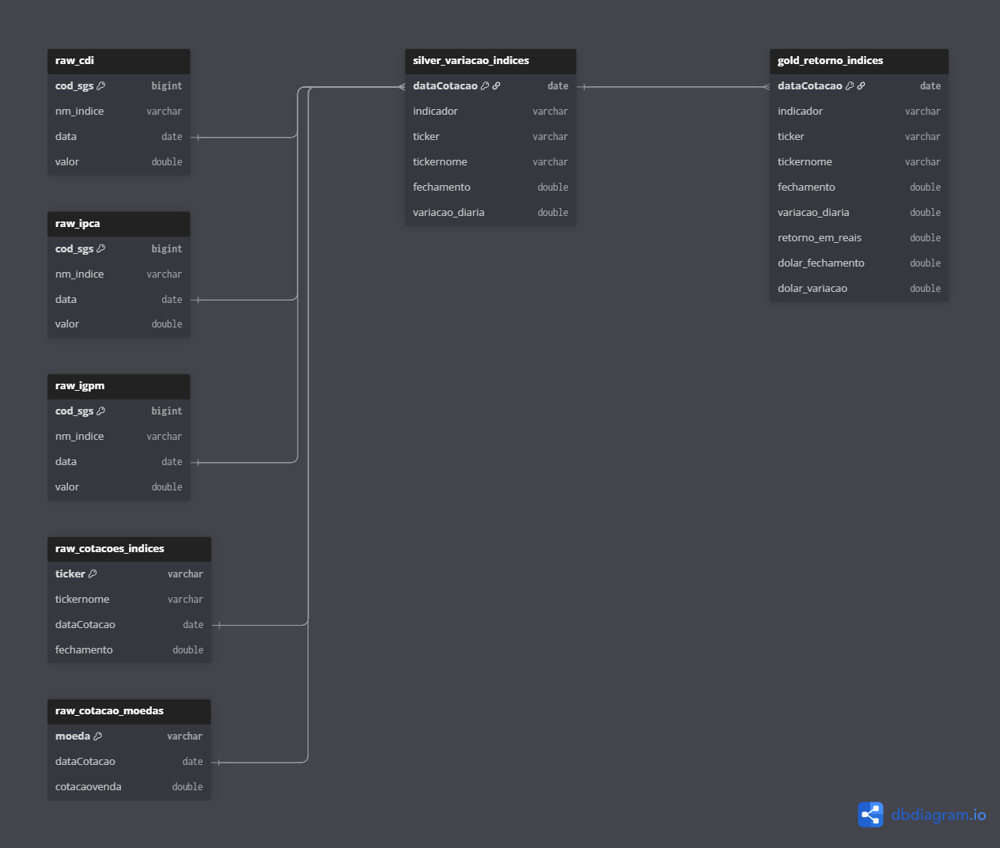

# dbt + python macro indexes api ELT

### The key idea to use this elt is to retrieve historical data from macro indexes from the brazilian economy mainly but also us stock market indexes. 

#### the main purpose here is to create a gold table with the return calculated by its daily variation along timing windows to compare with other databases and get the real return of the investment (IRR)

## Requirements:
in order to replicate this project you will need, after the clone:

1. a postgreSQL instance (needs to be mapped in the main.py, utils/connect and dbt/profiles.yml)

2. install requirements_pip libs and have a pyspark environment

## project structure 
    ├── __init__.py
    ├── __pycache__
    ├── dbt_macro_modelling -> dbt medallion modelling goes here
    ├── image.png
    ├── indexes_mer.png
    ├── logs
    ├── main.py -> main module
    ├── readme.md
    ├── requirements_pip.txt
    ├── tests -> unit tests
    └── utils -> modules for the use of main

### elt steps... 
1. extract = using pypi apis "python-bcb" for brazillian economy indexes and "yfinance"
   
   *currently used indexes:*
    | Fonte      | Índice / Ativo  | Descrição                                                                                                  |
    | ---------- | --------------- | ---------------------------------------------------------------------------------------------------------- |
    | python-bcb | IGP-M           | Monthly pricing index, calculated by FGV (mainly used as a USD impact inflation because of its composition)|
    | python-bcb | IPCA            | Monthly pricing index (Brazilian official inflation index by IBGE)                                         |
    | python-bcb | CDI             | Brazil's daily 'fed fund' rate                                                                             |
    | python-bcb | USD / EUR / CHF | Paired to BRL, daily buy and sell rates (PTAX)                                                             |
    | yfinance   | IDIV / DIVO11   | Brazilian large cap with dividends index                                                                   |
    | yfinance   | ^IBOV           | Brazilian stock market index IBOVESPA                                                                      |
    | yfinance   | ^GSPC           | S\&P500                                                                                                    |
    | yfinance   | VT              | Total world stock index etf by vanguard                                                                    |


2. load = transforming into raw tables in the rdbms (pgsql)
3. transform = with the use of dbt, retrieving data in the [medallion](https://learn.microsoft.com/en-us/azure/databricks/lakehouse/medallion) 
architecture 
(raw → silver → gold)

    # Ps: how the total return is calculated?
    in gold.retorno_indices we retrieve the BRL/USD selling price at the end of each day "fechamento" and calculate the index and the currency daily var by the formula 

    $$
    var(day)= (close (day)/close (day-1)) - 1
    $$ 

    1. the return, **not including** the currency impacts would be seen in 'variacao_diaria'

    ```sql

    select datacotacao as date,
           indicador as index,
           tickernome as tickerdesc,
           fechamento as close, variacao_diaria as dailyvar
    from indexes_gold.retorno_indices 
    where indicador in ('S&P500','VT', 'IDIV') and datacotacao >= '2025-01-01'
    order by datacotacao desc, indicador
    ; 

    ```
    
    2. the return **INCLUDING** the currency variation would be observed in 'retorno_em_reais' which converts BRL in the case of USD based indexes by the following formula:

    $$
    BRL_{yield} = Ticker_{Var}(day) + USD/BRL_{Var}(day) + (Ticker_{Var}(day) \times USD/BRL_{Var}(day))
    $$

    *the USD Var is not applied in brl indexes (from python-bcb) from the table above.*

    ```sql
    SELECT 
        a.datacotacao AS date,
        a.indicador AS index,
        a.ticker,
        a.fechamento AS close, 
        a.variacao_diaria AS IndexDayVar,
        a.retorno_em_reais AS BRLyield, 
        a.dolar_fechamento AS USDtoBRLSell,
        a.dolar_variacao AS USDtoBRLdayVar,
        -- comparison with bronze
        b.cotacaovenda AS USDtoBRLPrice 
    FROM indexes_gold.retorno_indices AS a
    LEFT JOIN raw.cotacao_moedas AS b
        ON a.datacotacao = b.datacotacao
    WHERE a.indicador IN ('S&P500') 
    AND b.moeda = 'USD'
    ORDER BY datacotacao ASC, indicador;
    ```

    3. After all, it is possible to aggregate and retrieve the total return yield over certain windows by
    
    $$
    TotalReturn(w)=(1+r1​)×(1+r2​)×⋯×(1+rn​)−1
    $$

    ```sql
    WITH t AS (
        SELECT
            dataCotacao AS date,
            ticker,
            variacao_diaria AS daily_var,
            -- sum of ln(1+r) from the start up to the current row
            SUM(
                CASE WHEN 1 + variacao_diaria > 0 THEN LN(1 + variacao_diaria) ELSE NULL END
            ) OVER (
                PARTITION BY ticker
                ORDER BY dataCotacao
                ROWS BETWEEN UNBOUNDED PRECEDING AND CURRENT ROW
            ) AS sum_ln,
            -- counts if there is any non-positive factor in the window -> if >0 we will return NULL
            SUM(
                CASE WHEN 1 + variacao_diaria <= 0 THEN 1 ELSE 0 END
            ) OVER (
                PARTITION BY ticker
                ORDER BY dataCotacao
                ROWS BETWEEN UNBOUNDED PRECEDING AND CURRENT ROW
            ) AS count_nonpos
        FROM indexes_gold.retorno_indices
        WHERE ticker IN ('^GSPC','VT')   -- adjust the list as needed
    )
    SELECT
        date,
        ticker,
        daily_var,
        CASE
            WHEN count_nonpos = 0 THEN EXP(sum_ln) - 1  -- returns compound cumulative return
            ELSE NULL                                   -- presence of invalid factor
        END AS cumulative_return
    FROM t
    ORDER BY ticker, date ASC
    LIMIT 200;
    ```

# Medallion


# Credits
- yfinance: https://github.com/ranaroussi/yfinance
- python-bcb: https://wilsonfreitas.github.io/python-bcb/
